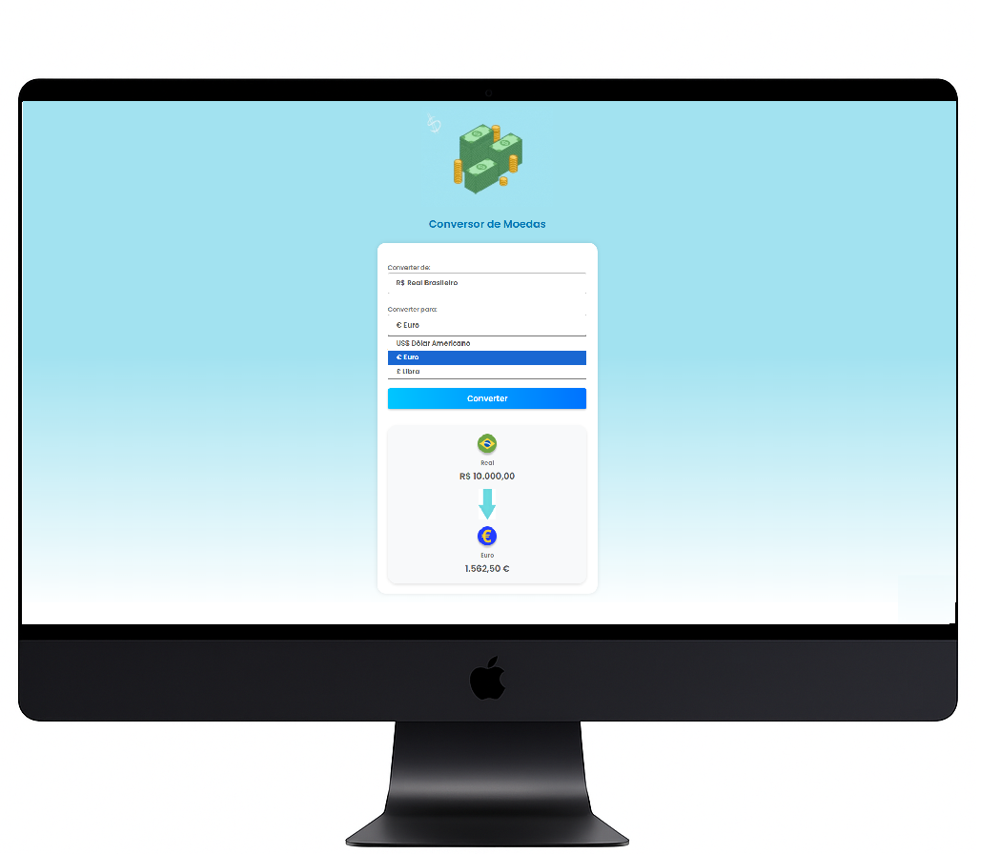
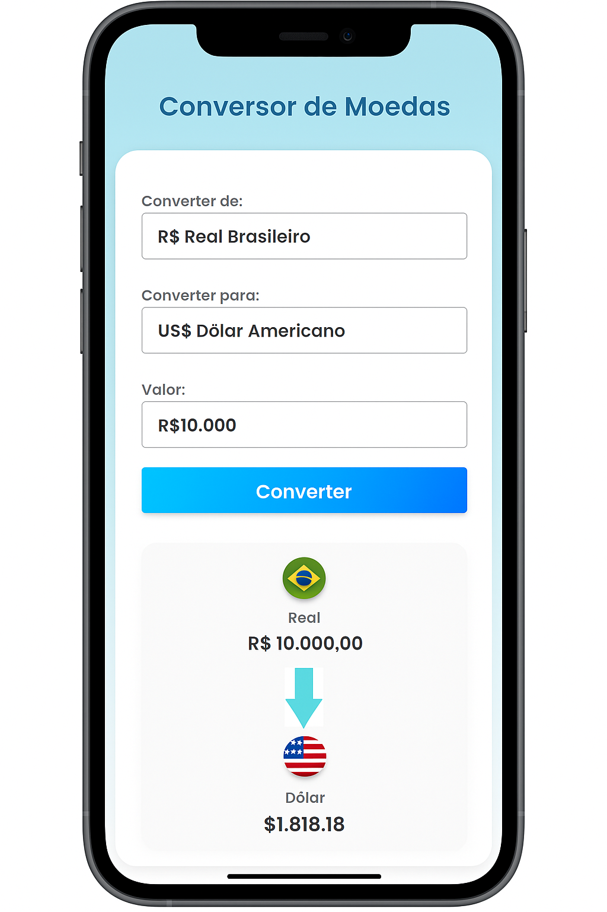

## 💱 Conversor de Moedas

Projeto desenvolvido para praticar **JavaScript**, com foco na manipulação do DOM, eventos e funções.
O conversor realiza a conversão de valores em **Real (BRL)** para **Dólar (USD)**, **Euro (EUR)** e **Libra Esterlina (GBP)**, utilizando uma interface simples e responsiva.

### 🛠️ Tecnologias utilizadas:
- HTML
- CSS
- JavaScript

### 📱 Responsividade:
O layout se adapta a diferentes tamanhos de tela, com visual limpo tanto no desktop quanto em dispositivos móveis.

### 🖼️ Imagens do projeto:

**Visualização no computador:**  
  
  

**Visualização responsiva (celular):**  

### Você pode ver meu site em:

https://adriciachiarini.github.io/conversor-de-moedas/

